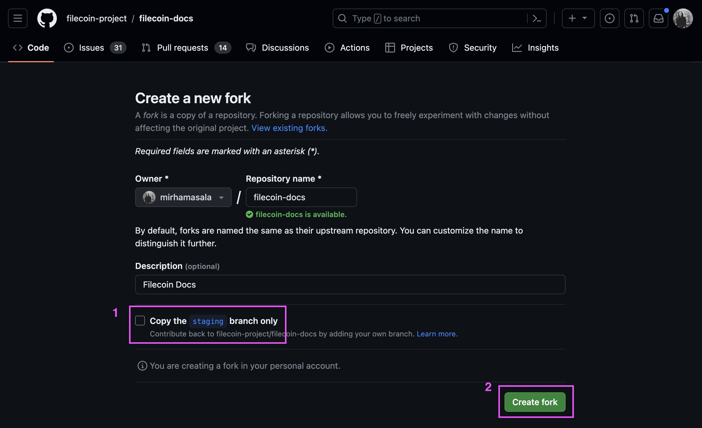

<picture align="center">
  <source media="(prefers-color-scheme: dark)" srcset="./static/images/logos/filecoin-governance-logo-dark-scheme.svg">
  <source media="(prefers-color-scheme: light)" srcset="./static/images/logos/filecoin-governance-logo-light-scheme.svg">
  
</picture>

 
 

This repository contains the instructions to add documentation to the <a href="https://docs.filecoin.io/">Filecoin docs website →</a>.

<!-- TABLE OF CONTENTS -->
## Table of contents

- [Table of contents](#table-of-contents)
- [Getting Started](#getting-started)
  - [Prerequisites](#prerequisites)
  - [Guide](#guide)
    - [Creating a fork](#creating-a-fork)
    - [Moving into the `feat/governance-section` branch](#moving-into-the-featgovernance-section-branch)
    - [Before adding content](#before-adding-content)
    - [Adding content](#adding-content)
    - [Saving content](#saving-content)
    - [Opening a pull request](#opening-a-pull-request)
      - [Note on opening pull requests](#note-on-opening-pull-requests)
- [Tips](#tips)
<!-- /TABLE OF CONTENTS -->

<!-- GETTING STARTED-->
## Getting Started

Follow this guide to add documentation to the Filecoin docs website through GitHub directly.<!-- /GETTING STARTED-->

<!-- PREREQUISITES -->
### Prerequisites

To follow this guide, you must have a [GitHub](https://github.com/) account.
<!-- /PREREQUISITES -->

<!-- GUIDE -->
### Guide

Follow these steps to add documentation to the Filecoin docs website through GitHub directly.

#### Creating a fork

1. Go to https://github.com/filecoin-project/filecoin-docs

2. Click the `Fork` button [^1]

3. Uncheck the checkmark next to the text `Copy the staging branch only` and press the `Create fork` button

You have now successfully created a fork of the original filecoin-docs repository.

#### Moving into the `feat/governance-section` branch

1. On the following screen, press the `branches` tab

2. Search for `governance` and then follow the link `feat/governance-section`

#### Before adding content

1. Ensure that you're on the  `feat/governance-section` branch

Note, if you aren't seeing the `/governance` directory under `/basics`, you might be on the wrong branch

2. Ensure your fork is in sync with the original docs before adding new content. Press the `Sync fork` button. That way, you'll sync any changes that others have made with your fork/copy.

#### Adding content

1. Move into the `/content/en` directory

2. Move into the `/basics` directory, and following, move into the `/governance` directory

3. Move into the directory where you wish to add content, for example, `/fip-process`, and open the `index.md` file

4. Press the pencil button to edit the file

5. To add a file, press the `Add file` button inside a directory

#### Saving content

1. Once done with editing, press the `Commit changes...` button or press `Cmd + s`

2. Commit changes with a helpful message [^2]

#### Opening a pull request

1. Move to `Pull Requests`

2. Press `Compare & pull request` [^3]

3. Ensure the pull request is being made against the `filecoin-project/filecoin-docs` repo, and against the `feat/governance-section`

4. Check your changes and press `Create pull request`

You have now successfully submitted your changes for review.

##### Note on opening pull requests

It's useful to have a pull request per page. For example, if you're writing about the FIP Process, create a pull request for that page. However, if you're making a bunch of edits or updates across a few different pages, then you can do that in one pull request.
<!-- /GUIDE -->

<!-- TIPS -->
## Tips

1. Read the [filecoin.doc README](https://github.com/filecoin-project/filecoin-docs). The [Front-matter variables section](https://github.com/filecoin-project/filecoin-docs#front-matter-variables) might be especially useful.

2. Browse the directories of other documentation sections in the `/content/en` directory for ideas. It might be especially helpful to check the `raw` view of files by pressing the `raw` button inside a file.

3. Ask ChatGPT to convert any document or text as Markdown.

4. Ask ChatGPT to create individual Markdown bits, like, for example, a table.
<!-- /TIPS -->

[^1]: _A fork_ is just another term for _A copy_

[^2]: _Commit changes_ is just another way of saying _Save changes_

[^3]: A pull request sends your edits over to the maintainers of the original filecoin-docs for approval. Once approved, your changes will be merged (a.k.a _added_) to the original repository.
